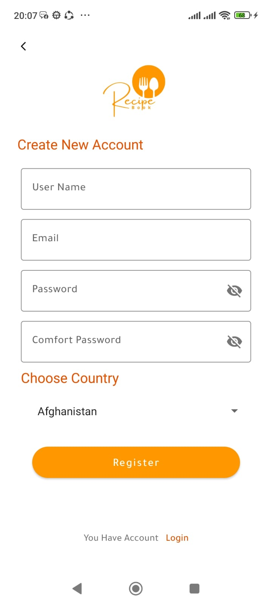

# Recipe Book

## App Description
Recipe Book is an Android application powered by Firebase that allows users to share, discover,
and save cooking recipes within a social platform environment. Users can securely register and log in, 
then post their own recipes complete with images, detailed instructions, and nutritional information. 
The app features a dynamic home screen displaying all recipes and followers' recipes, 
organized by categories with tabs and real-time notifications. Users can search and filter recipes by category,
rating, preparation time, and calories. Each user has a personalized profile showcasing their contributed recipes, followers, and following list.

## App Features
- User registration and secure login with saved sessions.
- Home screen showing all recipes and recipes from followed users.
- Real-time notifications for new followers, comments, and recipe uploads by followed users.
- Search and filter recipes by name, category, rating, preparation time, and calories.
- Add, edit, and delete personal recipes.
- Bookmark favorite recipes for easy access.
- Detailed recipe view with ingredients, preparation steps, user comments, ratings, option to rate the recipe, add comments, and save it.
- User profile showing follower count, following list, user’s recipes, and editable bio.
- Settings screen with logout, password change, and app information.
- Authentication screens including registration, login, and password recovery.
- Interactive feedback for user actions (e.g., toast messages).

## Screenshots
## Screenshots

### Splash & Authentication
- 
- 
- 
- 

### Home & Navigation
- 
- 
- 
- 
- 

### Recipes
- 
- 
- 
- 
- 
- 
### Bookmark
- 
  
### Search
- 
- 

### Profile
- 
- 
- 
- 
- 
- 

